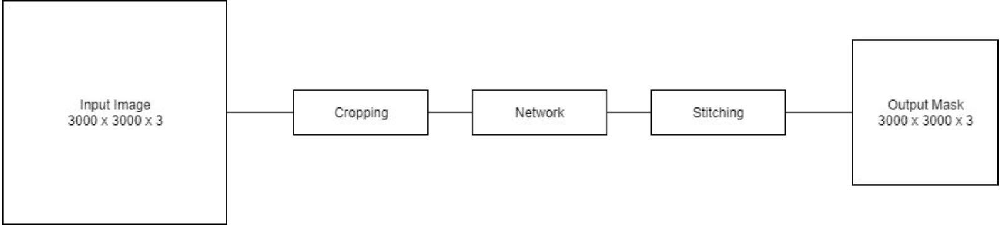
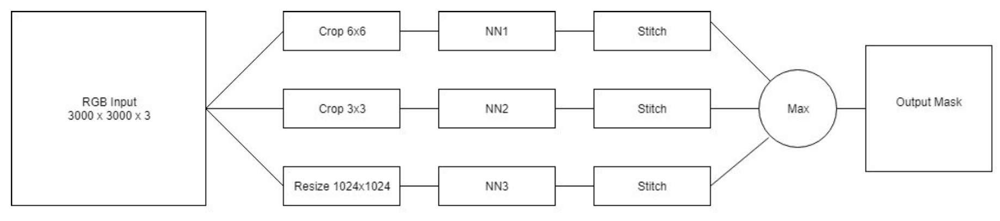

# MSIS4SI: Multi Scale Image Segmentation in Satellite images
Python notebook to demonstrate use of a prosposed neural network architecture for large scale Image segmentation.
This architecture is usefull when the segmentation you do have the following properties:
- Image is large in size.
- Resizing is not an option, due to probable loss of information.
- The segmentation depends upon features that are visible at different scales of cropping the image.

## Problem

Initial goal: Building segmentation in satellite images, but satellite images are big so generally solutions crop them images and feed to the neural network this can lead to these two problems:
- An object can be very small part of the image.
- An object can be very big part of the image.

To solve these problem using single neural network would be difficult plus the complexity of the network would have to be high in order to achieve higher accuracy.

## Approach
This approach proposes an Neural Network architecture that can be used when your target object occupies varying amount of area in your input Image.

The Ratios can be determined by studying the data one small rule can: ‘Let the smallest ratio be in which the smallest target object is completely fitted in one cropped image’.

### Tradional approaches vs this approach
Traditional approaches crop the large image and forward pass it throught the neural network and then stich back the segmented masks.

#### Problems with Tradional
- Network needs to be complex.
- Network needs to learn the variance of target object size.
- One Ratio isn’t enough.

What we suggest is to have multiple neural network which look(have their input) at the images at different zoom levels(leading to different crop ratios). And then create an ensemble of the output given by these networks. Flowchart to understand more: 

*To understand mmore about the ratio please read the code*
